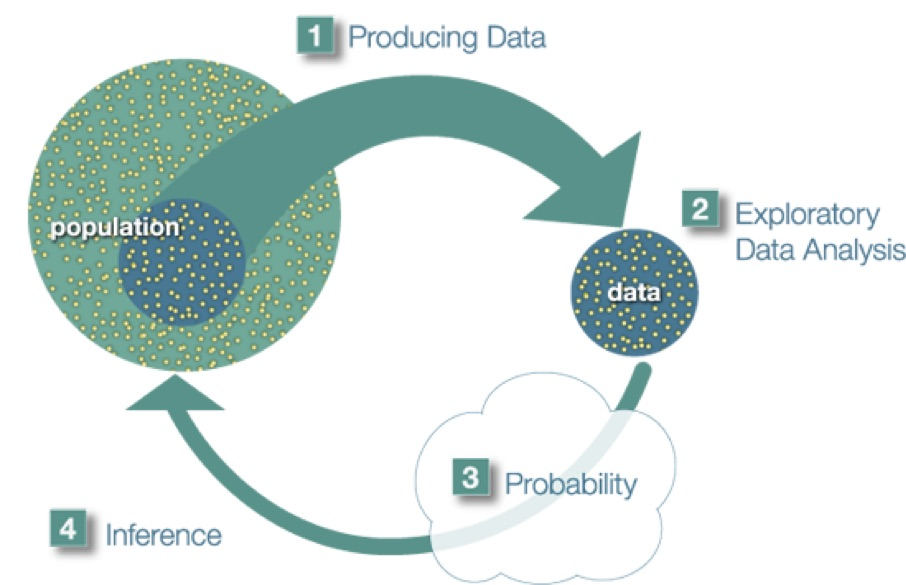

# Overview

Please watch the [Course Introduction Video](http://passiondrivenstatistics.com/2015/05/20/chapter-01-course-introduction/).

This statistics course is presented in the service of a project of your choosing and will offer you an intensive hands-on experience in the quantitative research process. You will develop skills in 1) generating testable hypotheses; 2) understanding large data sets; 3) formatting and managing data; 4) conducting descriptive and inferential statistical analyses; and 5) presenting results for expert and novice audiences. It is designed for students who are interested in developing skills that are useful for working with data and using statistical tools to analyze them. No prior experience with data or statistics is required. 

Our approach is “statistics in the service of questions.” As such, the research question that you choose (from data sets made available to you) is of paramount importance to your learning experience. **It must interest you enough that you will be willing to spend many hours thinking about it and analyzing data having to do with it.**

## Resources

This course is unlike any you have likely encountered in that you will be driving the content and direction of your own learning. In many ways we will be asking more from you than any other introductory course ever has. To support you in this challenge, there are a number of useful resources.

**This Book:** This book integrates the applied steps of a research project with the basic knowledge needed to meaningfully engage in quantitative research. Much of the background on descriptive and inferential statistics has been drawn from the [Open Learning Initiative](http://oli.cmu.edu/), a not-for-profit educational project aimed at transforming instruction and improving learning outcomes for students.

**Empowerment Through Statistical Computing:** While there is widespread argument that introductory students need to learn statistical programming, opinions differ widely both within and across disciplines about the specific statistical software program that should be used. While many introductory statistics courses cover the practical aspects of using a single software package, our focus will be more generally on computing as a skill that will expand your capacity for statistical application and for engaging in deeper levels of quantitative reasoning. Instead of providing “canned” exercises for you to repeat, you will be provided with flexible syntax for achieving a host
of data management and analytic tasks in the pursuit of answers to questions of greatest interest to you. Most importantly, syntax for `R` will be presented in the context of each step of the research process.

**Loads of Support:** Through the in-class workshop sessions and peer group exchanges, a great deal of individualized support will be available to you. Taking advantage of this large amount of support means that you are succeeding in making the most of your experience in this course.

**GitHub Repository:** To provide reliable backup of your work, you will use a private GitHub repository. While you will have read/write access to your own repository, you will also have read access to all public repositories in the organization (Course). Aside from providing a centralized way to share files, GitHub is meant to function as a resource in support of collaboration. Put simply, our hope is that you work together!

## An Introduction to Statistics^[https://oli.cmu.edu/jcourse/workbook/activity/page?context=434b846480020ca6018dda7ea62a2528]

Statistics plays a significant role across the physical and social sciences and is arguably the most salient point of intersection between diverse disciplines given that researchers constantly communicate information on varied topics through the common language of statistics. In a nutshell, what statistics is all about is converting data into useful information. Statistics is therefore a process where we are:

* Collecting Data
* Summarizing Data, and
* Interpreting Data

The process of statistics starts when we identify what group we want to study or learn something about. We call this group the **population**. Note the word “population” here (and in the entire course) is not just used to refer to people; it is used in the more broad statistical sense, where population can refer not only to people, but also to animals, things, etc. For example, we might be interested in:

* The opinions of the population of U.S. adults about the death penalty
* How the population of mice react to a certain chemical
* The average price of the population of all one-bedroom apartments in a certain city

Population, then, is the entire group that is the target of our interest.  In most cases, the population is so large that as much as we want to, there is absolutely no way that we can study all of it (imagine trying to get opinions of all U.S. adults about the death penalty...). 

A more practical approach would be to examine and collect data only from a sub-group of the population, which we call a sample. We call this first step, which involves choosing a sample and collecting data from it, *Producing Data*.

Since, for practical reasons, we need to compromise and examine only a sub-group of the population rather than the whole population, we should make an effort to choose a sample in such a way that it will represent the population as well. 

For example, if we choose a sample from the population of U.S. adults, and ask their opinions about the death penalty, we do not want our sample to consist of only Republicans or only Democrats.  

Once the data have been collected, what we have is a long list of answers to questions, or numbers, and in order to explore and make sense of the data, we need to summarize that list in a meaningful way. This second step, which consists of summarizing the collected data, is called *Exploratory Data Analysis.*

Now we’ve obtained the sample results and summarized them, but we are not done. Remember that our goal is to study the population, so what we want is to be able to draw conclusions about the population based on the sample results. Before we can do so, we need to look at how the sample we’re using may differ from the population as a whole, so that we can factor that into our analysis.  Finally, we can use what we’ve discovered about our sample to draw conclusions about our population. We call this final step Inference. This is the *Big Picture of Statistics*. 

**Since we will be relying on data that has already been produced, the focus of your individual project will be *exploratory* and *inferential* data analysis.**

**Example**
At the end of April 2005, a poll was conducted (by ABC News and the Washington Post), for the purpose of learning the opinions of U.S. adults about the death penalty.

1.  Producing Data:  A (representative) sample of 1,082 U.S. adults was chosen, and each adult was asked whether he or she favored or opposed the death penalty.

2.  Exploratory Data Analysis (EDA): The collected data was summarized, and it was found that 65% of the sample’s adults favor the death penalty for persons convicted of murder.

3. Inference: Based on the sample result (of 65% favoring the death penalty), it was concluded (within 95% confidence) that the percentage of those who favor the death penalty in the population is within 3% of what was obtained in the sample (i.e., between 62% and 68%). The following figure summarizes the example:

Final Notes:

Statistics education is often conducted within a discipline specific context or as generic mathematical training. Our goal is instead to create meaningful dialogue across disciplines. Ultimately, this experience is aimed at helping you on your way to engaging in interdisciplinary scholarship at the highest levels.

-------------------------
