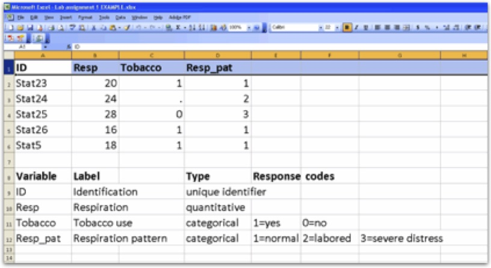

# Data Architecture 

**Data Architecture^[https://oli.cmu.edu/jcourse/workbook/activity/page?context=434b846d80020ca60084af88b54dce2b]---What do we really mean by data?**

Data are pieces of information about individuals or observations organized into variables. By an *individual* or *observation*, we mean a particular person or object. By a *variable*, we mean a particular characteristic of the individual or observation.

A dataset is a collection of information, usually presented in tabular form. Each column represents a particular *variable*. Each row corresponds to a given individual (or *observation*) within the dataset.

Relying on datasets, statistics pulls all of the behavioral, physical and social sciences together. It’s arguably the one language that we all have in common. While you may think that data is very, very different from discipline to discipline, it is not. What you measure is different, and your research question is obviously dramatically different; whom you observe and whom you collect data from---or what you collect data from---can be very different, but once you have the data, approaches to analyzing it statistically are quite similar regardless of individual discipline.

**Example: Medical Recordings**
The following dataset shows medical records from a particular survey:

In this example, the individuals are patients, and the variables are Gender, Age, Weight, Height, Smoking, and Race. Each row, then, gives us all the information about a particular individual or observation (in this case, patient), and each column gives us the information about a particular characteristic of all the patients.

Variables can be classified into one of two types: quantitative or categorical.

* *Quantitative Variables* take numerical values and represent some kind of measurement
* *Categorical Variables* take category or label values and place an individual into one of several groups. In our example of medical records, there are several variables of each type:
* Age, Weight, and Height are **quantitative** variables
* Race, Gender, and Smoking are **categorical** variables

Notice that the values of the categorical variable, Smoking, have been coded as the numbers 0 or 1. It is quite common to code the values of a categorical variable as numbers, but you should remember that these are just codes (often called dummy codes). They have no arithmetic meaning (i.e., it does not make sense to add, subtract, multiply, divide, or compare the magnitude of such values.)
A unique identifier is a variable that is meant to distinctively define each of the individuals or observations in your data set. Examples might include serial numbers (for data on a particular product), social security numbers (for data on individual persons), or random numbers (generated for any type of observations). Every data set should have a variable that uniquely identifies the observations. In this example, the patient number (1 through 75) is a unique identifier.

**Medical Records Assignment**
Although you will be working with previously collected data, it is important to understand what data looks like as well as how it is coded and entered into a spreadsheet or dataset for analysis.
Using medical records for 5 patients seeking treatment in a hospital emergency room.

1. Select 4 variables recorded on the medical forms (one should be a unique identifier, at least one should be a quantitative variable and at least one should be a categorical variable)

2. Select a brief name (ideally 8 characters or less) for each variable

3. Determine what range of values is needed for recording each variable (create dummy codes as needed)

4. Label variables within an Excel spreadsheet

5. Enter data for each patient in the Excel spreadsheet

6. List the variable names, labels, types, and, response codes below the data set (i.e. the code book).

7. Push the Excel spreadsheet to your private GitHub repository.

**Model:**

**Personal Code Book (AKA Research Question) Assignment**

One of the simplest research questions that can be asked is whether two constructs are associated. For example:
a) Is medical treatment seeking associated with socio-economic status?

b) Is water fluorination associated with number of cavities during dentist visits?

c) Is humidity associated with caterpillar reproduction?

**Example:**

*After looking through the codebook for the NESARC study, I have decided that I am particularly interested in nicotine dependence. I am not sure which variables I will use regarding nicotine dependence (e.g. symptoms or diagnosis) so for now I will include all of the relevant variables in my personal codebook.*

At this point, you should continue to explore the code book for the data set you have selected.

After choosing a data set, you should:

1. Identify a specific topic of interest

2. Prepare a codebook of your own (i.e., print individual pages (or copy screen and paste into a new document) from the larger codebook that includes the questions/items/variables that measure your selected topics.)

**Example:**

*While nicotine dependence is a good starting point, I need to determine what it is about nicotine dependence that I am interested in. It strikes me that friends and acquaintances that I have known through the years that became hooked on cigarettes did so across very different periods of time. Some seemed to be dependent soon after their first few experiences with smoking and others after many years of generally irregular smoking behavior. I decide that I am most interested in exploring the association between level of smoking and nicotine dependence. I add to my codebook variables reflecting smoking levels (e.g. smoking quantity and frequency).*

During a second review of the codebook for the dataset that you have selected, you should:

1. Identify a second topic that you would like to explore in terms of its association with your original topic

2. Add questions/items/variables documenting this second topic to your personal codebook.

Following completion of the steps described above, show your instructor and peer mentor (in class) a hard copy of your personal codebook. **Keep this in a folder or binder for your own use throughout the course.**

------------------------