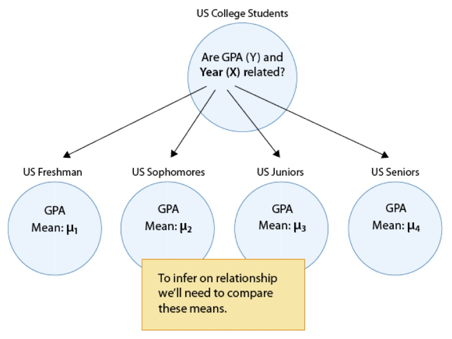
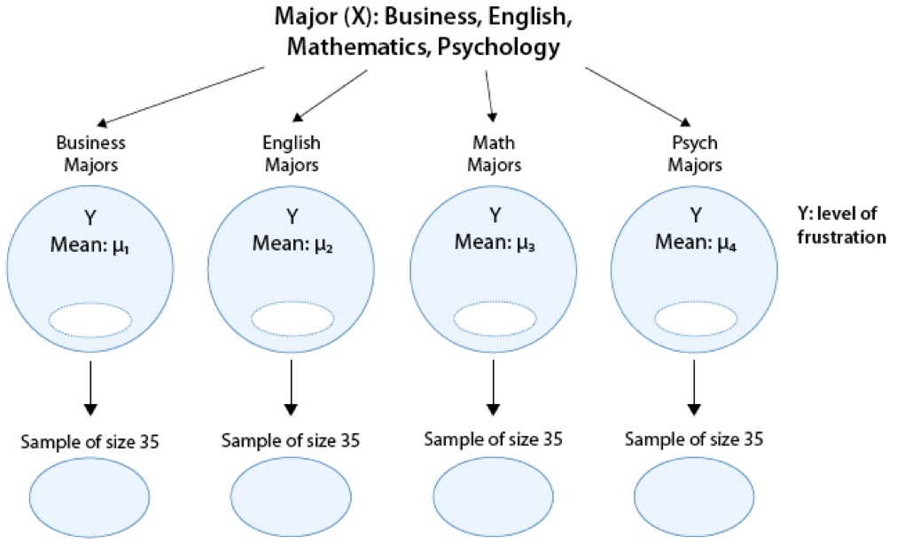
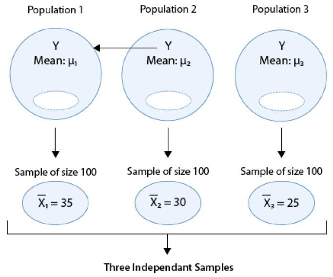

# Analysis of Variance^[https://oli.cmu.edu/jcourse/workbook/activity/page?context=434b8ad280020ca60166a71faa2caf60]

Please watch the [Chapter 11 video](http://passiondrivenstatistics.com/2016/05/11/r-chapter-11/).

In our description of hypothesis testing in the previous chapter, we started with case $C \rightarrow Q$, where the explanatory variable/independent variable/predictor ($X$ = major depression) is categorical and the response variable/dependent variable/outcome ($Y$ = number of cigarettes smoked) is quantitative. Here is a similar example:

**GPA and Year in College**

Say that our variable of interest is the GPA of college students in the United States. Since GPA is quantitative, we do inference on $\mu$, the (population) mean GPA among all U.S. college students. We are really interested in the relationship between GPA and college year:

$X$: year in college (1 = freshmen, 2 = sophomore, 3 = junior, 4 = senior) and
$Y$: GPA

In other words, we want to explore whether GPA is related to year in college. The way to think about this is that the population of U.S. college students is now broken into 4 sub-populations: freshmen, sophomores, juniors, and seniors. Within each of these four groups, we are interested in the GPA.


The inference must therefore involve the 4 sub-population means:

* $\mu_1$: mean GPA among freshmen in the United States
* $\mu_2$: mean GPA among sophomores in the United States 
* $\mu_3$: mean GPA among juniors in the United States
* $\mu_4$: mean GPA among seniors in the United States

It makes sense that the inference about the relationship between year and GPA has to be based on some kind of comparison of these four means. If we infer that these four means are not all equal (i.e., that there are some differences in GPA across years in college) then that's equivalent to saying GPA is related to year in college. Let's summarize this example with a figure:



In general, then, making inferences about the relationship between $X$ and $Y$ in Case $C\rightarrow Q$ boils down to comparing the means of $Y$ in the sub-populations, which are created by the categories defined in $X$ (say $k$ categories). The following figure summarizes this:


The inferential method for comparing means is called Analysis of Variance (abbreviated as ANOVA), and the test associated with this method is called the ANOVA F-test. We will first present our leading example, and then introduce the ANOVA F-test by going through its 4 steps, illustrating each one using the example.

*Is "academic frustration" related to major?*

A college dean believes that students with different majors may experience different levels of academic frustration. Random samples of size 35 of Business, English, Mathematics, and Psychology majors are asked to rate their level of academic frustration on a scale of 1 (lowest) to 20 (highest).



The figure highlights that examining the relationship between major ($X$) and frustration level ($Y$) amounts to comparing the mean frustration levels ($\mu_1, \mu_2,\mu_3,\mu_4$) among the four majors defined by $X$.

## The ANOVA F-Test

Now that we understand in what kind of situations ANOVA is used, we are ready to learn how it works.

**Stating the Hypotheses**

The null hypothesis claims that there is no relationship between $X$ and $Y$. Since the relationship is examined by comparing $\mu_1, \mu_2,\ldots,\mu_k$ (the means of $Y$ in the populations defined by the values of $X$), no relationship would mean that all the means are equal. Therefore the null hypothesis of the F-testis: $H_0: \mu_1 = \mu_2 = \cdots = \mu_k$.

As we mentioned earlier, here we have just one alternative hypothesis, which claims that there is a relationship between $X$ and $Y$.  In terms of the means $\mu_1, \mu_2,\ldots,\mu_k$ it simply says the opposite of the alternative, that not all the means are equal, and we simply write: $H_a:$ not all the $\mu$'s are equal.

Recall our "Is academic frustration related to major?" example:


**Review: True or False**

The hypothesis that are being test in our example are:

$H_0: \mu_1 = \mu_2 = \mu_3 = \mu_4$

$H_1: \mu_1 \neq \mu_2 \neq \mu_3 \neq \mu_4$

The correct hypotheses for our example are:

$H_0: \mu_1 = \mu_2 = \mu_3 = \mu_4$

$H_1: \mu_i \neq \mu_j$ for some $i,j$

Note that there are many ways for $\mu_1, \mu_2,\mu_3,\mu_4$ not to be all equal, and $\mu_1 \neq \mu_2 \neq \mu_3 \neq \mu_4$ is just one of them. Another way could be $\mu_1 = \mu_2 = \mu_3 \neq \mu_4$ or $\mu_1 = \mu_2 \neq \mu_3 \neq \mu_4$.  The alternative of the ANOVA F-test simply states that not all of the means are equal and is not specific about the way in which they are different.

## The Idea Behind the ANOVA F-Test

Let's think about how we would go about testing whether the population means $\mu_1, \mu_2,\mu_3,\mu_4$ are equal. It seems as if the best we could do is to calculate their point estimates—the sample mean in each of our 4 samples (denote them by $\bar{x}_1,\bar{x}_2,\bar{x}_3,\bar{x}_4)$,


and see how far apart these sample means are, or, in other words, measure the variation between the sample means. If we find that the four sample means are not all close together, we'll say that we have evidence against $H_0$, and otherwise, if they are close together, we'll say that we do not have evidence against $H_0$. This seems quite simple, but is this enough? Let's see.

It turns out that:

```{r}
library(PDS)
MEANS <- with(data = frustration, 
              tapply(Frustration.Score, Major, mean)
)
MEANS
summary(aov(Frustration.Score ~ Major, data = frustration))
```

* The sample mean frustration score of the 35 business majors is: $\bar{x}_1 = `r MEANS[1]`$
* The sample mean frustration score of the 35 English majors is: $\bar{x}_2 = `r MEANS[2]`$
* The sample mean frustration score of the 35 mathematics majors is: $\bar{x}_3 = `r MEANS[3]`$
* The sample mean frustration score of the 35 psychology majors is: $\bar{x}_4 = `r MEANS[4]`$


We present two possible scenarios for our example (different data). In both cases, we construct side-by-side box plots (showing the distribution of the data including the range, lowest and highest values, the mean, etc.) four groups of frustration levels that have the same variation among their means. Thus, Scenario #1 and Scenario #2 (the actual values from `frustration`) both show data for four groups with the sample means `r MEANS[1]`, `r MEANS[2]`, `r MEANS[3]`, and `r MEANS[4]`.

```{r, echo = FALSE}
library(dplyr)
frus <- frustration %>% 
  arrange(Major, Frustration.Score) %>% 
  mutate(Frustration.Score = Frustration.Score + rep(seq(-25, 25, length = 35), 4))
ggplot(data = frus, aes(x = Major, y = Frustration.Score)) + geom_boxplot() + theme_bw() + 
  labs(x = "", y = "Frustration Score", title = "Scenario 1")
ggplot(data = frustration, aes(x = Major, y = Frustration.Score)) + geom_boxplot() + theme_bw() + 
  labs(x = "", y = "Frustration Score", title = "Scenario 2")
```
  
**Review 11.2 Multiple Choice**

Look carefully at the graphs of both scenarios. For which of the two scenarios would you be willing to believe that samples have been taken from four groups which have the same population means?

A. Scenario 1

B. Scenario 2

The important difference between the two scenarios is that the first represents data with a large amount of variation within each of the four groups; the second represents data with a small amount of variation within each of the four groups.

Scenario 1, because of the large amount of spread within the groups, shows box plots with plenty of overlap. One could imagine the data arising from 4 random samples taken from 4 populations, all having the same mean of about 11 or 12. The first group of values may have been a bit on the low side, and the other three a bit on the high side, but such differences could conceivably have come about by chance. This would be the case if the null hypothesis, claiming equal population means, were true. Scenario 2, because of the small amount of spread within the groups, shows boxplots with very little overlap. It would be very hard to believe that we are sampling from four groups that have equal population means. This would be the case if the null hypothesis, claiming equal population means, were false.

Thus, in the language of hypothesis tests, we would say that if the data were configured as they are in scenario 1, we would not reject the null hypothesis that population mean frustration levels were equal for the four majors. If the data were configured as they are in scenario 2, we would reject the null hypothesis, and we would conclude that mean frustration levels differ depending on major.

Let's summarize what we learned from this. The question we need to answer is: Are the differences among the sample means ($\bar{x}$'s) due to true differences among the $\mu$'s (alternative hypothesis), or merely due to sampling variability (null hypothesis)?

In order to answer this question using our data, we obviously need to look at the variation among the sample means, but this alone is not enough. We need to look at the variation among the sample means relative to the variation within the groups. In other words, we need to look at the quantity:

$$\frac{\text{VARIATION AMONG SAMPLE MEANS}}{\text{VARIATION WITHIN GROUPS}}$$

which measures to what extent the difference among the sampled groups' means dominates over the usual variation within sampled groups (which reflects differences in individuals that are typical in random samples).

When the variation within groups is large (like in scenario 1), the variation (differences) among the sample means could become negligible and the data provide very little evidence against $H_0$.  When the variation within groups is small (like in scenario 2), the variation among the sample means dominates over it, and the data have stronger evidence against $H_0$.  Looking at this ratio of variations is the idea behind the comparison of means; hence the name analysis of variance (ANOVA).

**Did I Get This?**

Consider the following generic situation:



where we're testing:

$H_0: \mu_1 = \mu_2 = \mu_3$ versus $H_a:\mu_i \neq \mu_j$ for some $i,j$ or not all $\mu$'s are equal.

```{r, echo = FALSE}
set.seed(2)
s1 <- rnorm(100, 25, 2)
s2 <- rnorm(100, 30, 2)
s3 <- rnorm(100, 35, 2)
DF <- data.frame(s1, s2, s3)
DF1 <- stack(DF)
DF2 <- DF1 %>% 
  arrange(values, ind) %>% 
  mutate(values = values + rep(seq(-10, 10, length = 100), 3))
MEANS <- with(data = DF1,
     tapply(values, ind, mean)
     )
```

The following are two possible scenarios of the data (note in both scenarios the sample means are `r MEANS[1]`, `r MEANS[2]`, and `r MEANS[3]`).

```{r, echo = FALSE, fig.width = 8}
library(PASWR2)
p1 <- ggplot(data = DF1, aes(x = values, fill = ind)) + geom_density(alpha = 0.2) + theme_bw() + labs(x = "", y = "", title = "Scenario 1")
p2 <- ggplot(data = DF1, aes(x = ind, y = values)) + geom_boxplot() + theme_bw() + coord_flip() + labs(x = "", y = "", title = "Scenario 1")
p3 <- ggplot(data = DF2, aes(x = values, fill = ind)) + geom_density(alpha = 0.2) + theme_bw() + labs(x = "", y = "", title = "Scenario 2")
p4 <- ggplot(data = DF2, aes(x = ind, y = values)) + geom_boxplot() + theme_bw() + coord_flip() + labs(x = "", y = "", title = "Scenario 2")
multiplot(p1, p2, cols = 1)
multiplot(p3, p4, cols = 1)
```

**Consider the `frustration` Data Frame Again**

```{r}
ggplot(data = frustration, aes(x = Major, y = Frustration.Score)) +
  geom_boxplot() +
  theme_bw() + 
  labs(y = "Frustration Score", x = "", title = "Frustration Score by Major")
RES <- summary(aov(Frustration.Score ~ Major, data = frustration))
RES
```

Note that the F-statistic is `r RES[[1]][1, 4]`, which is very large, indicating that the data provide evidence against $H_0$ (we can also see that the p-value is so small ($`r RES[[1]][1, 5]`$) that it is essentially 0, which supports that conclusion as well).

## Finding the P-Value

The p-value of the ANOVA F-test is the probability of getting an F statistic as large as we got (or even larger) had $H_0: \mu_1 = \mu_2 = \cdots = \mu_k$ been true. In other words, it tells us how surprising it is to find data like those observed, assuming that there is no difference among the population means $\mu_1, \mu_2, \ldots, \mu_k$. As we already noticed before, the p-value in our example is so small that it is essentially 0, telling us that it would be next to impossible to get data like those observed had the mean frustration level of the four majors been the same (as the null hypothesis claims).

## Making Conclusions in Context

As usual, we base our conclusion on the p-value. A small p-value tells us that our data contain evidence against $H_0$. More specifically, a small p-value tells us that the differences between the sample means are statistically significant (unlikely to have happened by chance), and therefore we reject $H_0$.  If the p-value is not small, the data do not provide enough evidence to reject $H_0$, and so we continue to believe that it may be true. A significance level (cut-off probability) of 0.05 can help
determine what is considered a small p-value.

In our example, the p-value is extremely small (close to 0) indicating that our data provide extremely strong evidence to reject $H_0$. We conclude that the frustration level means of the four majors are not all the same, or, in other words, that majors do have an effect on students' academic frustration levels at the school where the test was conducted.

## Post Hoc Tests

When testing the relationship between your explanatory ($X$) and response variable ($Y$) in the context of ANOVA, your categorical explanatory variable ($X$) may have more than two levels.  

For example, when we examine the differences in mean GPA ($Y$) across different college years ($X$ = freshman, sophomore, junior and senior) or the differences in mean frustration level ($Y$) by college major ($X$ = Business, English, Mathematics, Psychology), there is just one alternative hypothesis, which claims that there is a relationship between $X$ and $Y$.

When the null hypothesis is rejected, the conclusion is that not all the means are equal.

Note that there are many ways for $\mu_1, \mu_2, \mu_3, \mu_4$ not to be all equal, and $\mu_1 \neq \mu_2 \neq \mu_3 \neq \mu_4$ is just one of them.  Another way could be $\mu_1 = \mu_2 = \mu_3 \neq \mu_4$ or $\mu_1 = \mu_2 \neq \mu_3 \neq \mu_4$

In the case where the explanatory variable ($X$) represents more than two groups, a significant ANOVA F test does not tell us which groups are different from the others.

To determine which groups are different from the others, we would need to perform post hoc tests. These tests, done after the ANOVA, are generally termed **post hoc paired comparisons.**

Post hoc paired comparisons (meaning “after the fact” or “afterdata collection”) must be conducted in a particular way in order to prevent excessive **Type I error**.

Type I error occurs when you make an incorrect decision about the null hypothesis. Specifically, this type of error is made when your p-value makes you reject the null hypothesis ($H_0$) when it is true. In other words, your p-value is sufficiently small for you to say that there is a real association, despite the fact that the differences you see are due to chance alone. The type I error rate equals your p-value and is denoted by the Greek letter $\alpha$ (alpha).

Although a Type I Error rate of 0.05 is considered acceptable (i.e. it is acceptable that 5 times out of 100 you will reject the null hypothesis when it is true), higher Type I error rates are not considered acceptable. If you were to use the significance level of 0.05 across multiple paired comparisons (for example, three independent comparisons) with $\alpha = 0 .05$, then the $\alpha$ rate across all three comparisons is $1 - (1 - \alpha)^{\text{Number of comparisons}} = 1 - (1 - 0.05)^3 = `r 1 - (1 - 0.05)^3`$. In other words, across the unprotected paired comparisons you will reject the null hypothesis when it is true roughly 14 times out of 100.

The purpose of running protected post hoc tests is that they allow you to conduct multiple paired comparisons without inflating the Type I Error rate.

For ANOVA, you can use one of several post hoc tests, each which control for Type I Error, while performing paired comparisons (Duncan Multiple Range test, Dunnett’s Multiple Comparison test, Newman-Keuls test, Scheffe’s test, Tukey’s HSD test, Fisher’s LSD test, Sidak).

**Analysis of Variance**

Analysis of variance assesses whether the means of two or more groups are statistically different from each other. This analysis is appropriate when you want to compare the means (quantitative variables) of $k$ groups (categorical variables) under certain assumptions (constant variance for all $k$ groups). The null hypothesis is that there is no difference in the mean of the quantitative variable across groups (categorical variable), while the alternative is that there is a difference.

```{r fig.width = 8}
TukeyHSD(aov(Frustration.Score ~ Major, data = frustration))
opar <- par(no.readonly = TRUE)
par(mar = c(5.1, 11.1, 4.1, 2.1), las = 1) # Enlarge left margin
plot(TukeyHSD(aov(Frustration.Score ~ Major, data = frustration)))
par(opar) # reset margins
```

Of the $\binom{4}{2}=6$ pairwise differences, Tukey's HSD suggest that all except `Mathematics - English` and `Psychology - Mathematics` are significant.

**Analysis of Variance Assignment**

Post the syntax to your private GitHub repository used to run an ANOVA along with corresponding output and a few sentences of interpretation. You will need to analyze and interpret post hoc paired comparisons in instances where your original statistical test was significant, and you were examining more than two groups (i.e. more than two levels of a categorical, explanatory variable). 

**Example of how to write results for ANOVA:**

```{r}
MEANS <- tapply(nesarc$DailyCigsSmoked, list(nesarc$TobaccoDependence), mean, na.rm = TRUE)
MEANS
SD <- tapply(nesarc$DailyCigsSmoked, list(nesarc$TobaccoDependence), sd, na.rm = TRUE)
SD
RES <- summary(aov(DailyCigsSmoked ~ TobaccoDependence, data = nesarc))
RES
```

When examining the association between current number of cigarettes smoked (quantitative response) and past year nicotine dependence (categorical explanatory), an Analysis of Variance (ANOVA) revealed that among daily, young adult smokers (my sample), those with nicotine dependence reported smoking significantly more cigarettes per day (Mean = `r round(MEANS[2],1)`, s.d. $\pm$ `r round(SD[2],1)`) compared to those without nicotine dependence (Mean = `r round(MEANS[1],1)`, s.d. $\pm$ `r round(SD[1],1)`), F(`r RES[[1]][1,1]`, `r RES[[1]][2, 1]`) = `r round(RES[[1]][1,4],1)`, p < 0.0001.


**Example of how to write post hoc ANOVA results:**

```{r, fig.width = 8}
nesarc$DCScat <- cut(nesarc$DailyCigsSmoked, breaks = c(0, 5, 10, 15, 20, 98), include.lowest = FALSE)
mod <- aov(NumberNicotineSymptoms ~ DCScat, data = nesarc)
RES <- summary(mod)
RES
tapply(nesarc$NumberNicotineSymptoms, nesarc$DCScat, mean)
TukeyHSD(mod)
opar <- par(no.readonly = TRUE)
par(mar = c(5.1, 8.1, 4.1, 2.1), las = 1) # Enlarge left margin
plot(TukeyHSD(mod))
par(opar)
```

ANOVA revealed that among daily, young adult smokers (my sample), number of cigarettes smoked per day (collapsed into 5 ordered categories, which is the categorical explanatory variable) and number of nicotine dependence symptoms (quantitative response variable) were significantly associated, F (`r RES[[1]][1,1]`, `r RES[[1]][2,1]`) = `r round(RES[[1]][1,4],2)`, p < 0.0001. Post hoc comparisons of mean number of nicotine dependence symptoms by pairs of cigarettes per day categories revealed that those individuals smoking more than 10 cigarettes per day (i.e. 11 to 15, 16 to 20 and >20) reported significantly more nicotine dependence symptoms compared to those smoking 10 or fewer cigarettes per day (i.e. 1 to 5 and 6 to 10 cigarettes per day).


----------------------------