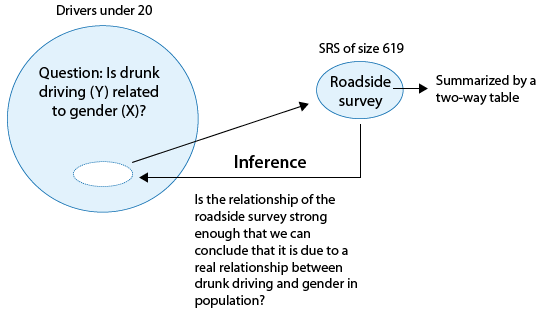

# Chi-Square Test of Independence^[https://oli.cmu.edu/jcourse/workbook/activity/page?context=434b8b0380020ca600863516c1304677]

Please watch the [Chapter 12 video](http://passiondrivenstatistics.com/2016/06/29/r-chapter-12/).

The last statistical test that we studied (ANOVA) involved the relationship between a categorical explanatory variable ($X$) and a quantitative response variable ($Y$). Next, we will consider inferences about the relationships between two categorical variables, corresponding to case $C \rightarrow C$.

In our graphing, we have already summarized the relationship between two categorical variables for a given data set, without trying to generalize beyond the sample data.


 Now we will perform statistical inference for two categorical variables, using the sample data to draw conclusions about whether or not we have evidence that the variables are related in the larger population from which the sample was drawn. In other words, we would like to assess whether the relationship between $X$ and $Y$ that we observed in the data is due to a real relationship between $X$ and $Y$ in the population, or if it is something that could have happened just by chance due to sampling variability.
 
The statistical test that will answer this question is called the chi-square test of independence. Chi is a Greek letter that looks like this: $\chi$, so the test is sometimes referred to as: The $\chi^2$ test of independence. 

Let's start with an **example**.

In the early 1970s, a young man challenged an Oklahoma state law that prohibited the sale of 3.2% beer to males under age 21 but allowed its sale to females in the same age group. The case (Craig v. Boren, 429 U.S. 190 [1976]) was ultimately heard by the U.S. Supreme Court.

The main justification provided by Oklahoma for the law was traffic safety. One of the 3 main pieces of data presented to the Court was the result of a "random roadside survey" that recorded information on gender and whether or not the driver had been drinking alcohol in the previous two hours. There were a total of 619 drivers under 20 years of age included in the survey.

The following two-way table summarizes the observed counts in the roadside survey:

```{r, echo = FALSE, results ='asis'}
library(xtable)
MAT <- matrix(data = c(77, 16, 404, 122), nrow = 2)
dimnames(MAT) <- list(Gender = c("Male","Female"), DroveDrunk = c("Yes", "No"))
library(vcdExtra)
TMAT <- as.table(MAT)
DFTMAT <- as.data.frame(TMAT) # convert to data frame
DF <- vcdExtra::expand.dft(DFTMAT)
TX <- addmargins(xtabs(~Gender + DroveDrunk, data = DF))
print(xtable(TX, caption = "Table showing drinking status during the last two hours and gender"), type = "html", caption.placement = "top")
```

The following code shows how to read the data into a matrix, then convert the matrix to a table, then to a data frame named `DF`.

```{r}
MAT <- matrix(data = c(77, 16, 404, 122), nrow = 2)
dimnames(MAT) <- list(Gender = c("Male","Female"), DroveDrunk = c("Yes", "No"))
library(vcdExtra)
TMAT <- as.table(MAT)
DFTMAT <- as.data.frame(TMAT) # convert to data frame
DF <- vcdExtra::expand.dft(DFTMAT)
xtabs(~Gender + DroveDrunk, data = DF)
addmargins(xtabs(~Gender + DroveDrunk, data = DF))
```

Our task is to assess whether these results provide evidence of a significant ("real") relationship between gender and drunk driving.

The following figure summarizes this example:



Note that as the figure stresses, since we are looking to see whether drunk driving is related to gender, our explanatory variable ($X$) is gender, and the response variable ($Y$) is drunk driving. Both variables are two-valued categorical variables, and therefore our two-way table of observed counts is 2-by-2. It should be mentioned that the chi-square procedure that we are going to introduce here is not limited to 2-by-2 situations, but can be applied to any r-by-c situation where r is the number of rows (corresponding to the number of values of one of the variables) and c is the number of columns (corresponding to the number of values of the other variable).

Before we introduce the chi-square test, let's conduct an exploratory data analysis (that is, look at the data to get an initial feel for it). By doing that, we will also get a better conceptual understanding of the role of the test.

## Exploratory Analysis

Recall that the key to reporting appropriate summaries for a two-way table is deciding which of the two categorical variables plays the role of explanatory variable, and then calculating the conditional percentages — the percentages of the response variable for each value of the explanatory variable — separately. In this case, since the explanatory variable is gender, we would calculate the percentages of drivers who did (and did not) drink alcohol for males and females separately.

Here is the table of conditional percentages:

```{r}
TA <- xtabs(~ Gender + DroveDrunk, data = DF)
prop.table(TA, 1)
```

For the 619 sampled drivers, a larger percentage of males were found to be drunk than females (16.0% vs. 11.6%). Our data, in other words, provide some evidence that drunk driving is related to gender; however, this in itself is not enough to conclude that such a relationship exists in the larger population of drivers under 20. We need to further investigate the data and decide between the following two points of view:

* The evidence provided by the roadside survey (16% vs 11.6%) is strong enough to conclude (beyond a reasonable doubt) that it must be due to a relationship between drunk driving and gender in the population of drivers under 20.

* The evidence provided by the roadside survey (16% vs. 11.6%) is not strong enough to make that conclusion, and could have happened just by chance, due to sampling variability, and not necessarily because a relationship exists in the population.

Actually, these two opposing points of view constitute the null and alternative hypotheses of the chi-square test for independence, so now that we understand our example and what we still need to find out, let's introduce the four-step process of this test.

## The Chi-Square Test for Independence

The chi-square test for independence examines our observed data and tells us whether we have enough evidence to conclude beyond a reasonable doubt that two categorical variables are related. Much like the previous part on the ANOVA F-test, we are going to introduce the hypotheses (step 1), and then discuss the idea behind the test, which will naturally lead to the test statistic (step 2). Let's start.

**Step 1:** Stating the hypotheses

Unlike all the previous tests that we presented, the null and alternative hypotheses in the chi-square test are stated in words rather than in terms of population parameters. They are:

$H_0:$ There is no relationship between the two categorical variables. (They are independent.)

$H_a:$ There is a relationship between the two categorical variables. (They are not independent.)

**EXAMPLE**

In our example, the null and alternative hypotheses would then state:

$H_0:$ There is no relationship between gender and drunk driving.

$H_a:$ There is a relationship between gender and drunk driving.

Or equivalently,

$H_0:$ Drunk driving and gender are independent

$H_a:$ Drunk driving and gender are not independent

and hence the name "chi-square test for independence."

## The Idea of the Chi-Square Test

The idea behind the chi-square test, much like previous tests that we've introduced, is to measure how far the data are from what is claimed in the null hypothesis. The further the data are from the null hypothesis, the more evidence the data presents against it. We'll use our data to develop this idea. Our data are represented by the observed counts:

```{r}
TA
```

How will we represent the null hypothesis?

In the previous tests we introduced, the null hypothesis was represented by the null value. Here there is not really a null value, but rather a claim that the two categorical variables (drunk driving and gender, in this case) are independent.

To represent the null hypothesis, we will calculate another set of counts — the counts that we would expect to see (instead of the observed ones) if drunk driving and gender were really independent (i.e., if $H_0$ were true). For example, we actually observed 77 males who drove drunk; if drunk driving and gender were indeed independent (if $H_0$ were true), how many male drunk drivers would we expect to see instead of 77? Similarly, we can ask the same kind of question about (and calculate) the other three cells in our table.

In other words, we will have two sets of counts:

* the observed counts (the data)

* the expected counts (if $H_0$ were true)

We will measure how far the observed counts are from the expected ones. Ultimately, we will base our decision on the size of the discrepancy between what we observed and what we would expect to observe if $H_0$ were true.

How are the expected counts calculated? Once again, we are in need of probability results. Recall from the probability section that if events $A$ and $B$ are independent, then $P(A \text{ and } B) = P(A) \times P(B)$. We use this rule for calculating expected counts, one cell at a time.

Here again are the observed counts:

```{r}
TA
```

If driving drunk and gender were independent then:

$$P(\text{drunk and male}) = P(\text{drunk}) \times P(\text{male})$$

By dividing the counts in our table, we see that:

$P(\text{Drunk}) = 93/619$ and

$P(\text{Male}) = 481/619$,

and so,

$P(\text{Drunk and Male}) = (93 / 619) (481 / 619)$

Therefore, since there are total of 619 drivers, **if drunk driving and gender were independent**, the count of drunk male drivers that I would **expect** to see is:

$619\times P(\text{Drunk and Male})=619(93/619)(481/619)=93\times 481/619 = `r 93*481/619`$

Notice that this expression is the product of the column and row totals for that particular cell, divided by the overall table total:

```{r}
chisq.test(TA)$expected
```

This will always be the case, and will help streamline our calculations:

$$\text{Expected Count} = \frac{\text{Column Total} \times \text{Row Total} }{\text{Table Total}}$$

**Step 3: Finding the p-value**

The p-value for the chi-square test for independence is the probability of getting counts like those observed, assuming that the two variables are not related (which is what is claimed by the null hypothesis). The smaller the p-value, the more surprising it would be to get counts like we did, if the null hypothesis were true.

Technically, the p-value is the probability of observing $\chi^2$ at least as large as the one observed. Using statistical software, we find that the p-value for this test is `r chisq.test(TA, correct = FALSE)$p.value`.

```{r}
chisq.test(TA, correct = FALSE)
```

**Step 4: Stating the conclusion in context**

As usual, we use the magnitude of the p-value to draw our conclusions. A small p-value indicates that the evidence provided by the data is strong enough to reject Ho and conclude (beyond a reasonable doubt) that the two variables are related. In particular, if a significance level of .05 is used, we will reject Ho if the p-value is less than .05.

**Example**

A p-value of `r chisq.test(TA, correct = FALSE)$p.value` is not small at all. There is no compelling statistical evidence to reject Ho, and so we will continue to assume it may be true. Gender and drunk driving may be independent, and so the data suggest that a law that forbids sale of 3.2% beer to males and permits it to females is unwarranted. In fact, the Supreme Court, by a 7-2 majority, struck down the Oklahoma law as discriminatory and unjustified. In the majority opinion Justice Brennan wrote (<http://www.law.umkc.edu/faculty/projects/ftrials/conlaw/craig.html>):

*"Clearly, the protection of public health and safety represents an important function of state and local governments. However, appellees' statistics in our view cannot support the conclusion that the gender-based distinction closely serves to achieve that objective and therefore the distinction cannot under [prior case law] withstand equal protection challenge."*

## Post Hoc Tests

For post hoc tests following a Chi-Square, we use what is referred to as the Bonferroni Adjustment. Like the post hoc tests used in the context of ANOVA, this adjustment is used to counteract the problem of Type I Error that occurs when multiple comparisons are made. Following a Chi-Square test that includes an explanatory variable with 3 or more groups, we need to subset to each possible paired comparison. When interpreting these paired comparisons, rather than setting the $\alpha$-level (p-value) at 0.05, we divide 0.05 by the number of paired comparisons that we will be making. The result is our new $\alpha$-level (p-value). For example, if we have a significant Chi-Square when examining the association between number of cigarettes smoked per day (a 5 level categorical explanatory variable: 1-5 cigarettes; 6 -10 cigarettes; 11–15 cigarettes; 16-20 cigarettes; and >20) and nicotine dependence (a two level categorical response variable – yes vs. no), we will want to know which pairs of the 5 cigarette groups are different from one another with respect to rates of nicotine dependence.

In other words, we will make $\binom{5}{2}=10$ comparisons (all possible comparisons). We will compare group 1 to 2; 1 to 3; 1 to 4; 1 to 5; 2 to 3; 2 to 4; 2 to 5; 3 to 4; 3 to 5; 4 to 5. When we evaluate the p-value for each of these post hoc chi-square tests, we will use 0.05/10 = 0.005 as our alpha. If the p-value is < 0.005 then we will reject the null hypothesis. If it is > 0.005, we will fail to reject the null hypothesis.

```{r}
NT <- xtabs(~ TobaccoDependence + DCScat, data = nesarc)
NT
chisq.test(NT, correct = FALSE)
chisq.test(NT[, c(1, 2)], correct = FALSE)
chisq.test(NT[, c(1, 3)], correct = FALSE)
chisq.test(NT[, c(1, 4)], correct = FALSE)
chisq.test(NT[, c(1, 5)], correct = FALSE)
chisq.test(NT[, c(2, 3)], correct = FALSE)
chisq.test(NT[, c(2, 4)], correct = FALSE)
chisq.test(NT[, c(2, 5)], correct = FALSE)
chisq.test(NT[, c(3, 4)], correct = FALSE)
chisq.test(NT[, c(3, 5)], correct = FALSE)
chisq.test(NT[, c(4, 5)], correct = FALSE)
# OR
library(fifer)
chisq.post.hoc(NT, control = "bonferroni", popsInRows  = FALSE)
```

**Chi Square Asssignment**

Post syntax to your private GitHub repository used to run a Chi-Square Test  along with corresponding output and a few sentences of interpretation. 

**Example of how to write results for Chi-Square tests:**

```{r, echo = FALSE}
T2 <- xtabs(~TobaccoDependence + MajorDepression, data = nesarc)
PA <- prop.table(T2, 1)
RES <- chisq.test(T2, correct = FALSE)
```

When examining the association between lifetime major depression (categorical response) and past year nicotine dependence (categorical explanatory), a chi-square test of independence revealed that among daily, young adults smokers (my sample), those with past year nicotine dependence were more likely to have experienced major depression in their lifetime (`r round(PA[2,2]*100,2)`%) compared to those without past year nicotine dependence (`r round(PA[1,2]*100,2)`%), $\chi^2=$ `r round(RES$stat,2)`, `r RES$parameter` df, p < 0.0001.

```{r}
T2 <- xtabs(~TobaccoDependence + MajorDepression, data = nesarc)
prop.table(T2, 1)
chisq.test(T2, correct = FALSE)
```

**Example of how to write post hoc Chi-Square results:**

A Chi Square test of independence revealed that among daily, young adult smokers (my sample), number of cigarettes smoked per day (collapsed into 5 ordered categories) and past year nicotine dependence (binary categorical variable) were significantly associated, $\chi^2$ = 45.16, 4 df, p < 0.0001. Post hoc comparisons of rates of nicotine dependence by pairs of cigarettes per day categories revealed that higher rates of nicotine dependence were seen among those smoking more cigarettes, up to 11 to 15 cigarettes per day. In comparison, prevalence of nicotine dependence was statistically similar among those groups smoking 10 to 15, 16 to 20, and > 20 cigarettes per day.

```{r, fig.width = 10}
T3 <- xtabs(~TobaccoDependence + DCScat, data = nesarc)
T3
prop.table(T3, 2)
library(ggplot2)
ggplot(data = nesarc[(!is.na(nesarc$TobaccoDependence) & 
                        !is.na(nesarc$DCScat)), ], 
       aes(x = DCScat, fill = TobaccoDependence)) + 
  geom_bar(position = "fill") +
  theme_bw() +
  labs(x= "Daily Smoking Frequency", y = "Fraction") +
  guides(fill = guide_legend(reverse = TRUE))
chisq.test(T3, correct = FALSE)
# Post hoc tests
chisq.test(T3[, c(1, 2)], correct = FALSE)
chisq.test(T3[, c(1, 3)], correct = FALSE)
chisq.test(T3[, c(1, 4)], correct = FALSE)
chisq.test(T3[, c(1, 5)], correct = FALSE)
chisq.test(T3[, c(2, 3)], correct = FALSE)
chisq.test(T3[, c(2, 4)], correct = FALSE)
chisq.test(T3[, c(2, 5)], correct = FALSE)
chisq.test(T3[, c(3, 4)], correct = FALSE)
chisq.test(T3[, c(3, 5)], correct = FALSE)
chisq.test(T3[, c(4, 5)], correct = FALSE)
```

-------------------------