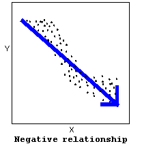
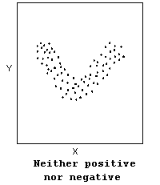
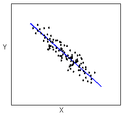
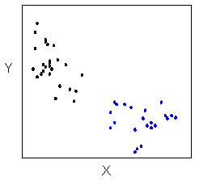
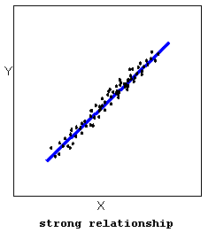
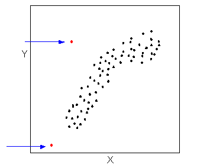

# Correlation Coefficient 


Please watch the [Chapter 13 Video](http://passiondrivenstatistics.com/2015/10/05/chapter-13/).

$Q \rightarrow Q$ is different in the sense that both variables (in particular the explanatory variable) are quantitative, and therefore, as you'll discover, this case will require a different kind of treatment and tools. Let's start with an example:

**Example**

**Highway Signs**^[https://oli.cmu.edu/jcourse/workbook/activity/page?context=434b85a180020ca600863541d4c89219]

A Pennsylvania research firm conducted a study in which 30 drivers (of ages 18 to 82 years old) were sampled, and for each one, the maximum distance (in feet) at which he/she could read a newly designed sign was determined. The goal of this study was to explore the relationship between a driver's age and the maximum distance at which signs were legible, and then use the study's findings to improve safety for older drivers. (Reference: Utts and Heckard, Mind on Statistics (2002). Originally source: Data collected by Last Resource, Inc, Bellfonte, PA.)

Since the purpose of this study is to explore the effect of age on maximum legibility distance, 

* the explanatory variable is Age, 

* and the response variable is Distance.

Here is what the first six rows of raw data look like:

```{r, echo = FALSE}
library(PDS)
knitr::kable(head(signdist))
```

Note that the data structure is such that for each individual (in this case driver 1....driver 30) we have a pair of values (in this case representing the driver's age and distance). We can therefore think about these data as 30 pairs of values: (18, 510), (32, 410), (55, 420), ... , (82, 360).

The first step in exploring the relationship between driver age and sign legibility distance is to create an appropriate and informative graphical display. The appropriate graphical display for examining the relationship between two quantitative variables is the scatterplot. Here is how a scatterplot is constructed for our example:

To create a scatterplot, each pair of values is plotted, so that the value of the explanatory variable ($X$) is plotted on the horizontal axis, and the value of the response variable ($Y$) is plotted on the vertical axis. In other words, each individual (driver, in our example) appears on the scatterplot as a single point whose $X$-coordinate is the value of the explanatory variable for that individual, and whose $Y$-coordinate is the value of the response variable. Here is an illustration:

```{r}
library(ggplot2)
ggplot(data = signdist, aes(x = Age, y = Distance)) + 
  geom_point(color = "purple") +
  theme_bw()
```

**Comment**

It is important to mention again that when creating a scatterplot, the explanatory variable should always be plotted on the horizontal $X$-axis, and the response variable should be plotted on the vertical $Y$-axis. If in a specific example we do not have a clear distinction between explanatory and response variables, each of the variables can be plotted on either axis.

## Interpreting the scatterplot

How do we explore the relationship between two quantitative variables using the scatterplot? What should we look at, or pay attention to?

Recall that when we described the distribution of a single quantitative variable with a histogram, we described the overall pattern of the distribution (shape, center, spread) and any deviations from that pattern (outliers). We do the same thing with the scatterplot. The following figure summarizes this point:


As the figure explains, when describing the overall pattern of the relationship we look at its direction, form and strength.

* The **direction** of the relationship can be positive, negative, or neither:





A **positive (or increasing) relationship** means that an increase in one of the variables is associated with an increase in the other.

A **negative (or decreasing) relationship** means that an increase in one of the variables is associated with a decrease in the other.

Not all relationships can be classified as either positive or negative.

The **form** of the relationship is its general shape. When identifying the form, we try to find the simplest way to describe the shape of the scatterplot. There are many possible forms. Here are a couple that are quite common:

Relationships with a **linear** form are most simply described as points scattered about a line:



Relationships with a **curvilinear** form are most simply described as points dispersed around the same curved line:


There are many other possible forms for the relationship between two quantitative variables, but linear and curvilinear forms are quite common and easy to identify. Another form-related pattern that we should be aware of is clusters in the data:



* The strength of the relationship is determined by how closely the data follow the form of the relationship. Let's look, for example, at the following two scatterplots displaying positive, linear relationships:




The strength of the relationship is determined by how closely the data points follow the form. We can see that in the top scatterplot the data points follow the linear pattern quite closely. This is an example of a strong relationship. In the bottom scatterplot, the points also follow the linear pattern, but much less closely, and therefore we can say that the relationship is weaker. In general, though, assessing the strength of a relationship just by looking at the scatterplot is quite problematic, and we need a numerical measure to help us with that. We will discuss that later in this section.

Data points that deviate from the pattern of the relationship are called outliers. We will see several examples of outliers during this section. Two outliers are illustrated in the scatterplot below:



Let's go back now to our example, and use the scatterplot to examine the relationship between the age of the driver and the maximum sign legibility distance. Here is the scatterplot:

```{r}
library(ggplot2)
ggplot(data = signdist, aes(x = Age, y = Distance)) + 
  geom_point(color = "purple") +
  theme_bw() + 
  labs(x = "Drivers Age (years)", y = "Sign Legibility Distance (feet)")
```

The direction of the relationship is negative, which makes sense in context, since as you get older your eyesight weakens, and in particular older drivers tend to be able to read signs only at lesser distances. An arrow drawn over the scatterplot illustrates the negative direction of this relationship:

```{r}
ggplot(data = signdist, aes(x = Age, y = Distance)) + 
  geom_point(color = "purple") +
  theme_bw() + 
  labs(x = "Drivers Age (years)", y = "Sign Legibility Distance (feet)") +
  stat_smooth(method = lm)
```

The form of the relationship seems to be **linear**. Notice how the points tend to be scattered about the line. Although, as we mentioned earlier, it is problematic to assess the strength without a numerical measure, the relationship appears to be **moderately strong**, as the data is fairly tightly scattered about the line. Finally, all the data points seem to "obey" the pattern—there **do not appear to be any outliers**.

## The Correlation Coefficient

The numerical measure that assesses the strength of a linear relationship is called the correlation coefficient, and is denoted by $r$. We will:

* give a definition of the correlation $r$,
* discuss the calculation of $r$,
* explain how to interpret the value of $r$, and
* talk about some of the properties of $r$.

**Definition:** The **correlation coefficient ($r$)** is a numerical measure that measures the strength and direction of a linear relationship between two quantitative variables.

**Calculation:** $r$ is calculated using the following formula: $r = \frac{1}{n-1}\sum_{i=1}^n \left(\frac{x_i - \bar{x}}{s_x}\right)\left(\frac{y_i - \bar{y}}{s_y}\right)$

However, the calculation of the correlation ($r$) is not the focus of this course. We will use a statistics package to calculate $r$ for us, and the **emphasis** of this course will be on the **interpretation** of its value.

**Interpretation**

Once we obtain the value of $r$, its interpretation with respect to the strength of linear relationships is quite simple, as this walk-through will illustrate:

  

In order to get a better sense for how the value of r relates to the strength of the linear relationship, take a look at [this applet](http://www.seeingstatistics.com/seeing1999/reg/corr.html).

The slider bar at the bottom of the applet allows us to vary the value of the correlation coefficient ($r$) between -1 and 1 in order to observe the effect on a scatterplot. (If the plot does not change on your browser when you move the slider, click along the bar instead to update the plot).

Now that we understand the use of r as a numerical measure for assessing the direction and strength of linear relationships between quantitative variables, we will look at a few examples.

**Example**

**Highway Sign Visibility**

Earlier, we used the scatterplot below to find a negative linear relationship between the age of a driver and the maximum distance at which a highway sign was legible. What about the strength of the relationship? It turns out that the correlation between the two variables is $r = `r cor(signdist$Age, signdist$Distance)`$.

```{r}
cor(signdist$Age, signdist$Distance)
cor.test(signdist$Age, signdist$Distance)
ggplot(data = signdist, aes(x = Age, y = Distance)) + 
  geom_point(color = "purple") +
  theme_bw() + 
  labs(x = "Drivers Age (years)", y = "Sign Legibility Distance (feet)") +
  stat_smooth(method = lm)
```

Since $r < 0$, it confirms that the direction of the relationship is negative (although we really didn't need $r$ to tell us that). Since $r$ is relatively close to -1, it suggests that the relationship is moderately strong. In context, the negative correlation confirms that the maximum distance at which a sign is legible generally decreases with age. Since the value of $r$ indicates that the linear relationship is moderately strong, but not perfect, we can expect the maximum distance to vary somewhat, even among drivers of the same age.

**Example**

**Statistics Courses**

A statistics department is interested in tracking the progress of its students from entry until graduation. As part of the study, the department tabulates the performance of 10 students in an introductory course and in an upper-level course required for graduation. What is the relationship between the students' course averages in the two courses? Here is the scatterplot for the data:

  

The scatterplot suggests a relationship that is **positive** in direction, **linear** in form, and seems quite strong. The value of the correlation that we find between the two variables is $r = 0.931$, which is very close to 1, and thus confirms that indeed the linear relationship is very strong.

**Pearson Correlation**

A correlation coefficient assesses the degree of linear relationship between two variables. It ranges from $+1$ to $-1$. A correlation of $+1$ means that there is a perfect, positive, linear relationship between the two variables. A correlation of $-1$ means there is a perfect, negative linear relationship between the two variables. In both cases, knowing the value of one variable, you can perfectly predict the value of the second.

**Pearson Correlation Assignment**

Post syntax to your private GitHub repo used to generate a correlation coefficient along with corresponding output and a few sentences of interpretation. 

**Note:** When we square $r$, it tells us what proportion of the variability in one variable is described by variation in the second variable (aka $R^2$ or Coefficient of Determination).

**Example of how to write results for correlation coefficient:** Among daily, young adult smokers (my sample), the correlation between number of cigarettes smoked per day (quantitative) and number of nicotine dependence symptoms experienced in the past year (quantitative) was `r cor(nesarc$DailyCigsSmoked, nesarc$NumberNicotineSymptoms, use = "complete.obs")` (p < 0.0001), suggesting that only `r round(cor(nesarc$DailyCigsSmoked, nesarc$NumberNicotineSymptoms, use = "complete.obs")^2*100,2)`% (i.e. `r cor(nesarc$DailyCigsSmoked, nesarc$NumberNicotineSymptoms, use = "complete.obs")` squared) of the variance in number of current nicotine dependence symptoms can be explained by number of cigarettes smoked per day.

```{r}
ggplot(data = nesarc, aes(x = DailyCigsSmoked, y = NumberNicotineSymptoms)) +
  geom_point(color = "lightblue") + 
  theme_bw() + 
  labs(x = "Number of cigarettes smoked daily", y = "Number of nicotine dependence symptoms")
cor.test(nesarc$DailyCigsSmoked, nesarc$NumberNicotineSymptoms)
r <- cor(nesarc$DailyCigsSmoked, nesarc$NumberNicotineSymptoms, use = "complete.obs")
r
r^2
```


--------------------