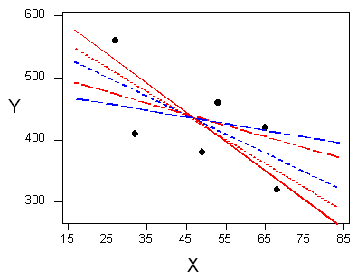
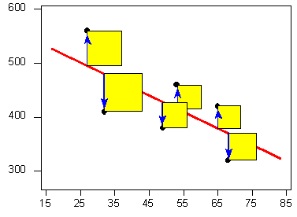

# Linear Regression: Summarizing the Pattern of the Data with a Line^[https://oli.cmu.edu/jcourse/workbook/activity/page?context=434b85ba80020ca600a81f9419678a69]

So far we've used the scatterplot to describe the relationship between two quantitative variables, and in the special case of a linear relationship, we have supplemented the scatterplot with the correlation ($r$). The correlation, however, doesn't fully characterize the linear relationship between two quantitative variables—it only measures the strength and direction. We often want to describe more precisely how one variable changes with the other (by "more precisely," we mean more than just the direction), or predict the value of the response variable for a given value of the explanatory variable. In order to be able to do that, we need to summarize the linear relationship with a line that best fits the linear pattern of the data. In the remainder of this section, we will introduce a way to find such a line, learn how to interpret it, and use it (cautiously) to make predictions.

Again, let's start with a motivating example:

Earlier, we examined the linear relationship between the age of a driver and the maximum distance at which a highway sign was legible, using both a scatterplot and the correlation coefficient. Suppose a government agency wanted to predict the maximum distance at which the sign would be legible for 60-year-old drivers, and thus make sure that the sign could be used safely and effectively.

How would we make this prediction?

```{r}
library(PDS)
mod.lm <- lm(Distance ~ Age, data = signdist)
summary(mod.lm)
predict(mod.lm, newdata = data.frame(Age = 60))
# Store the predicted value in PV
PV <- predict(mod.lm, newdata = data.frame(Age = 60))
PV
library(grid)
library(ggplot2)
ggplot(data = signdist, aes(x = Age, y = Distance)) + 
   geom_point(color = "purple") +
   theme_bw() + 
   labs(x = "Drivers Age (years)", y = "Sign Legibility Distance (feet)") + 
   geom_smooth(method = "lm", se = FALSE) + 
   geom_line(data = data.frame(Age = c(60, 60), 
                               Distance = c(280, PV)), 
             arrow = arrow(type = "closed", angle = 15), color = "red") + 
  geom_line(data = data.frame(Age = c(60, 19), Distance = c(PV, PV)),
            arrow = arrow(type = "closed", angle = 15, ends = "first"), color = "red")
```

The technique that specifies the dependence of the response variable on the explanatory variable is called regression. When that dependence is linear (which is the case in our examples in this section), the technique is called linear regression. Linear regression is therefore the technique of finding the line that best fits the pattern of the linear relationship (or in other words, the line that best describes how the response variable linearly depends on the explanatory variable).

To understand how such a line is chosen, consider the following very simplified version of the age-distance example (we left just 6 of the drivers on the scatterplot):


There are many lines that look like they would be good candidates to be the line that best fits the data:



It is doubtful that everyone would select the same line in the plot above. We need to agree on what we mean by "best fits the data"; in other words, we need to agree on a criterion by which we would select this line. We want the line we choose to be close to the data points. In other words, whatever criterion we choose, it had better somehow take into account the vertical deviations of the data points from the line, which are marked with blue arrows in the plot below:


The most commonly used criterion is called the **least squares criterion**. This criterion says: Among all the lines that look good on your data, choose the one that has the smallest sum of squared vertical deviations. Visually, each squared deviation is represented by the area of one of the squares in the plot below. Therefore, we are looking for the line that will have the smallest total yellow area.



This line is called the **least-squares regression line**, and, as we'll see, it fits the linear pattern of the data very well.

For the remainder of this lesson, you'll need to feel comfortable with the algebra of a straight line. In particular you'll need to be familiar with the **slope** and the **intercept** in the equation of a line, and their interpretation.

Like any other line, the equation of the least-squares regression line for summarizing the linear relationship between the response variable ($Y$) and the explanatory variable ($X$) has the form: $Y = a + bX$

All we need to do is calculate the intercept $a$, and the slope $b$, which is easily done if we know:

* $X$—the mean of the explanatory variable's values
* $S_X$—the standard deviation of the explanatory variable's values
* $Y$—the mean of the response variable's values
* $S_Y$—the standard deviation of the response variable's values
* $r$—the correlation coefficient

Given the five quantities above, the slope and intercept of the least squares regression line are found using the following formulas:

* $b = r (S_Y/S_X)$
* $a = \bar{Y} -b\bar{x}$

**Comments**

1.  Note that since the formula for the intercept a depends on the value of the slope, $b$, you need to find $b$ first.

2.  The slope of the least squares regression line can be interpreted as the average change in the response variable when the explanatory variable increases by 1 unit.

**Example**

**Age-Distance**

Let's revisit our age-distance example, and find the least-squares regression line. The following output will be helpful in getting the 5 values we need:

```{r}
MEAN <- apply(signdist, 2, mean)
MEAN
cor(signdist)
SD <- apply(signdist, 2, sd)
SD
mod.lm <- lm(Distance ~ Age, data = signdist)
coef(summary(mod.lm))
b <- coef(summary(mod.lm))[2, 1]
b
```

* The **slope** of the line is: $b = (`r cor(signdist)[2, 1]`) \times (`r SD[2]` / `r SD[1]`) = `r b`$. This means that for every 1-unit increase of the explanatory variable, there is, on average, a `r b`-unit decrease in the response variable. The interpretation in **context** of the slope being `r b` is, therefore: For every year a driver gets older, the maximum distance at which he/she can read a sign decreases, **on average**, by `r abs(b)` feet.

* The **intercept** of the line is:

$$a = `r MEAN[2]` + `r (-1)*b`\times `r MEAN[1]` = `r coef(summary(mod.lm))[1, 1]`$$

and therefore the least squares regression line for this example is:

$$\widehat{\text{Distance}} = `r coef(summary(mod.lm))[1, 1]` `r b`\times \text{Age}$$

Here is the regression line plotted on the scatterplot:

```{r}
ggplot(data = signdist, aes(x = Age, y = Distance)) + 
   geom_point(color = "purple") +
   theme_bw() + 
   labs(x = "Drivers Age (years)", y = "Sign Legibility Distance (feet)") + 
   geom_smooth(method = "lm", se = FALSE) +
   labs(title = expression(hat(Y) == "576.7 - 3x") )
```

As we can see, the regression line fits the linear pattern of the data quite well.

**Comment**

As we mentioned before, hand-calculation is not the focus of this course. We wanted you to see one example in which the least squares regression line is calculated by hand, but in general we'll let a statistics package do that for us.

Let's go back now to our motivating example, in which we wanted to predict the maximum distance at which a sign is legible for a 60-year-old. Now that we have found the least squares regression line, this prediction becomes quite easy:

```{r, echo = FALSE}
ggplot(data = signdist, aes(x = Age, y = Distance)) + 
   geom_point(color = "purple") +
   theme_bw() + 
   labs(x = "Drivers Age (years)", y = "Sign Legibility Distance (feet)") + 
   geom_smooth(method = "lm", se = FALSE) + 
   geom_line(data = data.frame(Age = c(60, 60), 
                               Distance = c(280, PV)), 
             arrow = arrow(type = "closed", angle = 15), color = "red") + 
  geom_line(data = data.frame(Age = c(60, 19), Distance = c(PV, PV)),
            arrow = arrow(type = "closed", angle = 15, ends = "first"), color = "red")
```

Practically, what the figure tells us is that in order to find the predicted legibility distance for a 60-year-old, we plug Age = 60 into the regression line equation, to find that:

Predicted distance = $`r coef(summary(mod.lm))[1, 1]` + (`r coef(summary(mod.lm))[2, 1]` \times 60) = `r PV`$.
`r PV` feet is our best prediction for the maximum distance at which a sign is legible for a 60-year-old.


------------------------