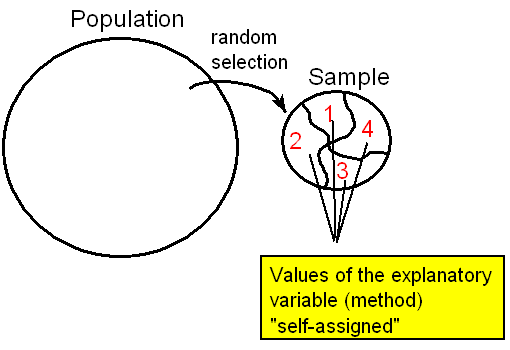
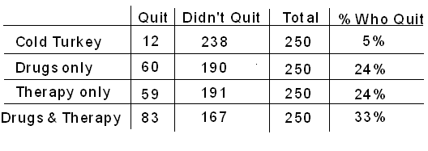

# Sampling and Designing Studies

Suppose you want to determine the musical preferences of all students at your university, based on a sample of students. Here are some examples of the many possible ways to pursue this problem.^[https://oli.cmu.edu/jcourse/workbook/activity/page?context=434b868a80020ca600eda22f1586f085]

**Example 1**

Post a music-lovers' survey on a university IInternet bulletin board, asking students to vote for their favorite type of music.

This is an example of a **volunteer sample**, where individuals have selected themselves to be included. Such a sample is almost guaranteed to be **biased**. In general, volunteer samples tend to be comprised of individuals who have a particularly strong opinion about an issue, and are looking for an opportunity to voice it. Whether the variable's values obtained from such a sample are over- or under-stated, and to what extent, cannot be determined. As a result, data obtained from a voluntary response sample is quite useless when you think about the "Big Picture," since the sampled individuals only provide information about themselves, and **we cannot generalize** to any larger group at all.

**Note** 

Comment: It should be mentioned that in some cases volunteer samples are the only ethical way to obtain a sample. In medical studies, for example, in which new treatments are tested, subjects must choose to participate by signing a consent form that highlights the potential risks and benefits. As we will discuss in the next module, a volunteer sample is not so problematic in a study conducted for the purpose of comparing several treatments.

**Example 2**

Stand outside the Student Union, across from the Fine Arts Building, and ask students passing by to respond to your question about musical preference.

This is an example of a **convenience sample**, where individuals happen to be at the right time and place to suit the schedule of the researcher. Depending on what variable is being studied, it may be that a convenience sample provides a fairly representative group. However, there are often subtle reasons why the sample's results are **biased**. In this case, the proximity to the Fine Arts Building might result in a disproportionate number of students favoring classical music. A convenience sample may also be susceptible to bias because certain types of individuals are more likely to be selected than others. In the extreme, some convenience samples are designed in such a way that certain individuals have no chance at all of being selected, as in the next example.

**Example 3**

Ask your professors for email rosters of all the students in your classes. Randomly sample some addresses, and email those students with your question about musical preference.

Here is a case where the **sampling frame**—list of potential individuals to be sampled—does not match the population of interest. The population of interest consists of all students at the university, whereas the sampling frame consists of only your classmates. There may be **bias** arising because of this discrepancy. For example, students with similar majors will tend to take the same classes as you, and their musical preferences may also be somewhat different from those of the general population of students. It is always best to have the sampling frame match the population as closely as possible.

**Example 4**

Obtain a student directory with email addresses of all the university's students, and send the music poll to every 50th name on the list.

This is called **systematic sampling**. It may not be subject to any clear bias, but it would not be as safe as taking a random sample.

If individuals are sampled completely at random, and without replacement, then each group of a given size is just as likely to be selected as all the other groups of that size. This is called a **simple random sample (SRS)**. In contrast, a systematic sample would not allow for sibling students to be selected, because of having the same last name. In a simple random sample, sibling students would have just as much of a chance of both being selected as any other pair of students. Therefore, there may be subtle sources of bias in using a systematic sampling plan.

**Example 5**

Obtain a student directory with email addresses of **all** the university's students, and send your music poll to a **simple random sample** of students. As long as all of the students respond, then the sample is **not subject to any bias**, and should succeed in being representative of the population of interest.

But what if only 40% of those selected email you back with their vote?

The results of this poll would not necessarily be representative of the population, because of the potential problems associated with **volunteer response**. Since individuals are not compelled to respond, often a relatively small subset take the trouble to participate. Volunteer response is not as problematic as a volunteer sample (presented in example 1 above), but there is still a danger that those who do respond are different from those who don't, with respect to the variable of interest. An improvement would be to follow up with a second email, asking politely for students' cooperation. This may boost the response rate, resulting in a sample that is fairly representative of the entire population of interest, and it may be the best that you can do, under the circumstances. **Nonresponse** is still an issue, but at least you have managed to reduce its impact on your results.

So far we've discussed several sampling plans, and determined that a simple random sample is the only one we discussed that is not subject to any bias.

A simple random sample is the easiest way to base a selection on randomness. There are other, more sophisticated, sampling techniques that utilize randomness that are often preferable in real-life circumstances. Any plan that relies on random selection is called a **probability sampling plan (or technique)**. The following three probability sampling plans are among the most commonly used:

* **Simple Random Sampling** is, as the name suggests, the simplest probability sampling plan. It is equivalent to “selecting names out of a hat.” Each individual as the same chance of being selected.

* **Cluster Sampling**—This sampling technique is used when our population is naturally divided into groups (which we call clusters). For example, all the students in a university are divided into majors; all the nurses in a certain city are divided into hospitals; all registered voters are divided into precincts (election districts). In cluster sampling, we take a random sample of clusters, and use all the individuals within the selected clusters as our sample. For example, in order to get a sample of high-school seniors from a certain city, you choose 3 high schools at random from among all the high schools in that city, and use all the high school seniors in the three selected high schools as your sample.

* **Stratified Sampling**—Stratified sampling is used when our population is naturally divided into sub-populations, which we call stratum (plural: strata). For example, all the students in a certain college are divided by gender or by year in college; all the registered voters in a certain city are divided by race. In stratified sampling, we choose a simple random sample from each stratum, and our sample consists of all these simple random samples put together. For example, in order to get a random sample of high-school seniors from a certain city, we choose a random sample of 25 seniors from each of the high schools in that city. Our sample consists of all these samples put together.

Each of those probability sampling plans, if applied correctly, are not subject to any bias, and thus produce samples that represent well the population from which they were drawn.

**Comment: Cluster vs. Stratified**

Students sometimes get confused about the difference between cluster sampling and stratified sampling. Even though both methods start out with the population somehow divided into groups, the two methods are very different. In cluster sampling, we take a random sample of whole groups of individuals, while in stratified sampling we take a simple random sample from each group. For example, say we want to conduct a study on the sleeping habits of undergraduate students at a certain university, and need to obtain a sample. The students are naturally divided by majors, and let's say that in this university there are 40 different majors. In cluster sampling, we would randomly choose, say, 5 majors (groups) out of the 40, and use all the students in these five majors as our sample. In stratified sampling, we would obtain a random sample of, say, 10 students from each of the 40 majors (groups), and use the 400 chosen students as the sample. Clearly in this example, stratified sampling is much better, since the major of the student might have an effect on the student's sleeping habits, and so we would like to make sure that we have representatives from all the different majors. We’ll stress this point again following the example and activity.

**Example**

Suppose you would like to study the job satisfaction of hospital nurses in a certain city based on a sample. Besides taking a simple random sample, here are two additional ways to obtain such a sample.

1. Suppose that the city has 10 hospitals. Choose one of the 10 hospitals at random and interview all the nurses in that hospital regarding their job satisfaction. This is an example of cluster sampling, in which the hospitals are the clusters.

2. Choose a random sample of 50 nurses from each of the 10 hospitals and interview these 50 * 10 = 500 regarding their job satisfaction. This is an example of stratified sampling, in which each hospital is a stratum.

**Cluster or Stratified—which one is better?**

Let’s go back and revisit the job satisfaction of hospital nurses example and discuss the pros and cons of the two sampling plans that are presented. Certainly, it will be much easier to conduct the study using the cluster sample, since all interviews are conducted in one hospital as opposed to the stratified sample, in which the interviews need to be conducted in 10 different hospitals. However, the hospital that a nurse works in probably has a direct impact on his/her job satisfaction, and in that sense, getting data from just one hospital might provide biased results. In this case, it will be very important to have representation from all the city hospitals, and therefore the stratified sample is definitely preferable. On the other hand, say that instead of job satisfaction, our study focuses on the age or weight of hospital nurses.

In this case, it is probably not as crucial to get representation from the different hospitals, and therefore the more easily obtained cluster sample might be preferable.

**Comment**:

Another commonly used sampling technique is **multistage sampling**, which is essentially a “complex form” of cluster sampling. When conducting cluster sampling, it might be unrealistic, or too expensive to sample all the individuals in the chosen clusters. In cases like this, it would make sense to have another stage of sampling, in which you choose a sample from each of the randomly selected clusters, hence the term multistage sampling.

For example, say you would like to study the exercise habits of college students in the state of California. You might choose 8 colleges (clusters) at random, but you are certainly not going to use all the students in these 8 colleges as your sample. It is simply not realistic to conduct your study that way. Instead you move on to stage 2 of your sampling plan, in which you choose a random sample of 100 males and a random sample of 100 females from each of the 8 colleges you selected in stage 1.

So in total you have $8 \times (100+100) = 1,600$ college students in your sample.

In this case, stage 1 was a cluster sample of 8 colleges and stage 2 was a stratified sample within each college where the stratum was gender.

Multistage sampling can have more than 2 stages. For example, to obtain a random sample of physicians in the United States, you choose 10 states at random (stage 1, cluster). From each state you choose at random 8 hospitals (stage 2, cluster). Finally, from each hospital, you choose 5 physicians from each sub-specialty (stage 3, stratified).

## Designing Studies

Obviously, sampling is not done for its own sake. After this first stage in the data production process is completed, we come to the second stage, that of gaining information about the variables of interest from the sampled individuals. In this module we'll discuss three study designs; each design enables you to determine the values of the variables in a different way. You can:

- Carry out an **observational study**, in which values of the variable or variables of interest are recorded as they naturally occur. There is no interference by the researchers who conduct the study.

- Take a **sample survey**, which is a particular type of observational study in which individuals report variables' values themselves, frequently by giving their opinions.

- Perform an **experiment**. Instead of assessing the values of the variables as they naturally occur, the researchers interfere, and they are the ones who assign the values of the explanatory variable to the individuals. The researchers "take control" of the values of the explanatory variable because they want to see how changes in the value of the explanatory variable affect the response variable. (Note: By nature, any experiment involves at least two variables.)

The type of design used, and the details of the design, are crucial, since they will determine what kind of conclusions we may draw from the results. In particular, when studying relationships in the Exploratory Data Analysis unit, we stressed that an association between two variables does not guarantee that a causal relationship exists. In this module, we will explore how the details of a study design play a crucial role in determining our ability to establish evidence of causation.

## Identifying Study Design

Because each type of study design has its own advantages and trouble spots, it is important to begin by determining what type of study we are dealing with. The following example helps to illustrate how we can distinguish among the three basic types of design mentioned in the introduction—observational studies, sample surveys, and experiments.

Suppose researchers want to determine whether people tend to snack more while they watch television. In other words, the researchers would like to explore the relationship between the explanatory variable "TV" (a categorical variable that takes the values "on'" and "not on") and the response variable "snack consumption."

Identify each of the following designs as being an observational study, a sample survey, or an experiment.

1. Recruit participants for a study. While they are presumably waiting to be interviewed, half of the individuals sit in a waiting room with snacks available and a TV on. The other half sit in a waiting room with snacks available and no TV, just magazines. Researchers determine whether people consume more snacks in the TV setting.

This is an **experiment**, because the researchers take control of the explanatory variable of interest (TV on or not) by **assigning** each individual to either watch TV or not, and determine the effect that has on the response variable of interest (snack consumption).

2. Recruit participants for a study. Give them journals to record hour by hour their activities the following day, including when they watch TV and when they consume snacks. Determine if snack consumption is higher during TV times.

This is an observational study, because the participants themselves determine whether or not to watch TV. There is no attempt on the researchers' part to interfere.

3. Recruit participants for a study. Ask them to recall, for each hour of the previous day, whether they were watching TV, and what snacks they consumed each hour. Determine whether snack consumption was higher during the TV times.

This is also an observational study; again, it was the participants themselves who decided whether or not to watch TV. Do you see the difference between 2 and 3? See the comment below.

4. Poll a sample of individuals with the following question: While watching TV, do you tend to snack: (a) less than usual; (b) more than usual; or (c) the same amount as usual?

This is a sample survey, because the individuals self-assess the relationship between TV watching and snacking.

**Comment**

Notice that in Example 2, the values of the variables of interest (TV watching and snack consumption) are recorded forward in time. Such observational studies are called **prospective**. In contrast, in Example 3, the values of the variables of interest are recorded backward in time. This is called a **retrospective** observational study. 

While some studies are designed to gather information about a single variable, many studies attempt to draw conclusions about the relationship between two variables. In particular, researchers often would like to produce evidence that one variable actually causes changes in the other. For example, the research question addressed in the previous example sought to establish evidence that watching TV could cause an increase in snacking. Such studies may be especially useful and interesting, but they are also especially vulnerable to flaws that could invalidate the conclusion of causation. In several of the examples in this module we will see that although evidence of an association between two variables may be quite clear, the question of whether one variable is actually causing changes in the other may be too murky to be entirely resolved. In general, with a well-designed experiment we have a better chance of establishing causation than with an observational study. However, experiments are also subject to certain pitfalls, and there are many situations in which an experiment is not an option. A well-designed observational study may still provide fairly convincing evidence of causation under the right circumstances.

## Experiments vs. Observational Studies

Before assessing the effectiveness of observational studies and experiments for producing evidence of a causal relationship between two variables, we will illustrate the essential differences between these two designs.

Every day, a huge number of people are engaged in a struggle whose outcome could literally affect the length and quality of their life: they are trying to quit smoking. Just the array of techniques, products, and promises available shows that quitting is not easy, nor is its success guaranteed. Researchers would like to determine which of the following is the best method:

1. Drugs that alleviate nicotine addiction.

2. Therapy that trains smokers to quit.

3. A combination of drugs and therapy.

4. Neither form of intervention (quitting "cold turkey").

The explanatory variable is the method (1, 2, 3 or 4) , while the response variable is eventual success or failure in quitting. In an observational study, values of the explanatory variable occur naturally. In this case, this means that the participants themselves choose a method of trying to quit smoking. In an experiment, researchers assign the values of the explanatory variable. In other words, they tell people what method to use. Let us consider how we might compare the four techniques, via either an observational study or an experiment.

1. An **observational study** of the relationship between these two variables requires us to collect a representative sample from the population of smokers who are beginning to try to quit. We can imagine that a substantial proportion of that population is trying one of the four above methods. In order to obtain a representative sample, we might use a nationwide telephone survey to identify 1,000 smokers who are just beginning to quit smoking. We record which of the four methods the smokers use. One year later, we contact the same 1,000 individuals and determine whether they succeeded.

2. In an **experiment**, we again collect a representative sample from the population of smokers who are just now trying to quit, using a nationwide telephone survey of 1,000 individuals. This time, however, we divide the sample into 4 groups of 250 and **assign** each group to use one of the four methods to quit. One year later, we contact the same 1,000 individuals and determine whose attempts succeeded while using our designated method.

The following figures illustrate the two study designs:

1. Observational study:

2. Experiment:

Both the observational study and the experiment begin with a random sample from the population of smokers just now beginning to quit. In both cases, the individuals in the sample can be divided into categories based on the values of the explanatory variable: method used to quit. The response variable is success or failure after one year. Finally, in both cases, we would assess the relationship between the variables by comparing the proportions of success of the individuals using each method, using a two-way table and conditional percentages.

The only difference between the two methods is the way the sample is divided into categories for the explanatory variable (method). In the observational study, individuals are divided based upon the method by which they choose to quit smoking. The researcher does not assign the values of the explanatory variable, but rather records them as they naturally occur. In the experiment, the researcher deliberately assigns one of the four methods to each individual in the sample. The researcher intervenes by controlling the explanatory variable, and then assesses its relationship with the response variable.

Now that we have outlined two possible study designs, let's return to the original question: which of the four methods for quitting smoking is most successful? Suppose the study's results indicate that individuals who try to quit with the combination drug/therapy method have the highest rate of success, and those who try to quit with neither form of intervention have the lowest rate of success, as illustrated in the hypothetical two-way table below:

Can we conclude that using the combination drugs and therapy method caused the smokers to quit most successfully? Which type of design was implemented will play an important role in the answer to this question.

-----------------------