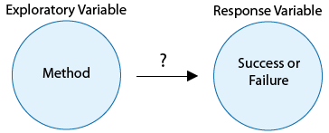
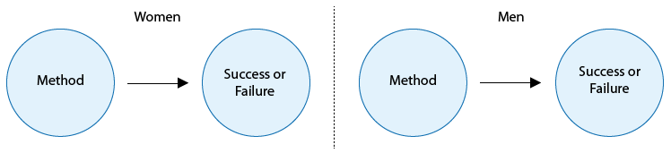

# Confounding and Multivariate Models

**Causation and Observational Studies^[https://oli.cmu.edu/jcourse/workbook/activity/page?context=434b864280020ca6007237338314349d]**

Please watch the [Chapter 17 Video](http://passiondrivenstatistics.com/2015/04/21/chapter-17-continued-rough-edit/).

Suppose the **observational study** described on the previous page were carried out, and researchers determined that the percentage succeeding with the combination drug/therapy method was highest, while the percentage succeeding with neither therapy nor drugs was lowest. In other words, suppose there is clear evidence of an association between method used and success rate. Could they then conclude that the combination drug/therapy method causes success more than using neither therapy nor a drug?



It is at precisely this point that we confront the underlying weakness of most observational studies: some members of the sample have opted for certain values of the explanatory variable (method of quitting), while others have opted for other values. It could be that those individuals may be different in additional ways that would also play a role in the response of interest. For instance, suppose women are more likely to choose certain methods to quit, and suppose women in general tend to quit more successfully than men. The data would make it appear that the method itself were responsible for success, whereas in truth it may just be that being female is the reason for success. We can express this scenario in terms of the key variables involved. In addition to the explanatory variable (method) and the response variable (success or failure), a third, **lurking** variable (gender) is tied in (or **confounded**) with the explanatory variable's values, and may itself cause the response to be success or failure. The following diagram illustrates this situation.


Since the difficulty arises because of the lurking variable's values being tied in with those of the explanatory variable, one way to attempt to unravel the true nature of the relationship between explanatory and response variables is to separate out the effects of the lurking variable. In general, we **control** for the effects of a lurking variable by separately studying groups that are similar with respect to this variable.

We could control for the lurking variable "gender" by studying women and men separately. Then, if both women and men who chose one method have higher success rates than those opting for another method, we would be closer to producing evidence of causation.



The diagram above demonstrates how straightforward it is to control for the lurking variable gender.

Notice that we did not claim that controlling for gender would allow us to make a definite claim of causation, only that we would be closer to establishing a causal connection. This is due to the fact that other lurking variables may also be involved, such as the level of the participants' desire to quit. Specifically, those who have chosen to use the drug/therapy method may already be the ones who are most determined to succeed, while those who have chosen to quit without investing in drugs or therapy may, from the outset, be less committed to quitting. The following diagram illustrates this scenario.


To attempt to control for this lurking variable, we could interview the individuals at the outset in order to rate their desire to quit on a scale of 1 (weakest) to 5 (strongest), and study the relationship between method and success separately for each of the five groups. But desire to quit is obviously a very subjective thing, difficult to assign a specific number to. Realistically, we may be unable to effectively control for the lurking variable "desire to quit."

Furthermore, who's to say that gender and/or desire to quit are the only lurking variables involved? There may be other subtle differences among individuals who choose one of the four various methods that researchers fail to imagine as they attempt to control for possible lurking variables. For example, smokers who opt to quit using neither therapy nor drugs may tend to be in a lower income bracket than those who opt for (and can afford) drugs and/or therapy. Perhaps smokers in a lower income bracket also tend to be less successful in quitting because more of their family members and co-workers smoke. Thus, socioeconomic status is yet another possible lurking variable in the relationship between cessation method and success rate.

It is because of the existence of a virtually unlimited number of potential lurking variables that we can never be 100% certain of a claim of causation based on an observational study. On the other hand, observational studies are an extremely common tool used by researchers to attempt to draw conclusions about causal connections. If great care is taken to control for the most likely lurking variables (and to avoid other pitfalls which we will discuss presently), and if common sense indicates that there is good reason for one variable to cause changes in the other, then researchers may assert that an observational study provides good evidence of causation.

**Confounding**

So far we have discussed different ways in which data can be used to explore the relationship (or association) between two variables. When we explore the relationship between two variables, there is often a temptation to conclude from the observed relationship that changes in the explanatory variable cause changes in the response variable. In other words, you might be tempted to interpret the observed association as causation. The purpose of this part of the course is to convince you that this kind of interpretation is often wrong! The motto of this section is one of the most fundamental principles of this course:  **Association does not imply causation!**

**Fire Damage**

The scatterplot below illustrates how the number of firefighters sent to fires ($X$) is related to the amount of damage caused by fires ($Y$) in a certain city.


The scatterplot clearly displays a fairly strong (slightly curved) **positive** relationship between the two variables. Would it, then, be reasonable to conclude that sending more firefighters to a fire causes more damage, or that the city should send fewer firefighters to a fire, in order to decrease the amount of damage done by the fire? Of course not! So what is going on here?

There is a **third variable in the background**—the seriousness of the fire—that is responsible for the observed relationship. More serious fires require more firefighters, and also cause more damage.

The following figure will help you visualize this situation:


Here, the seriousness of the fire is a confounding variable. In statistics, a confounding variable (also confounding factor, lurking variable, a confound, or confounder) is an extraneous variable that is associated (positively or negatively) with both the explanatory variable and response variable. We need to “control for” these factors to avoid incorrectly believing that the response variable is associated with the explanatory variable. Confounding is a major threat to the validity of inferences made about statistical associations. In the case of a confounding variable, the observed association with the response variable should be attributed to the confounder rather than the explanatory variable. In science, we test for confounders by including these “3rd variables” in our statistical models that may explain the association of interest. In other words, we want to demonstrate that our association of interest is significant even after controlling for potential confounders.

**Multivariate Modeling**

Because adding potential confounding variables to our statistical model can help us to gain a deeper understanding of the relationship between variables or lead us to rethink the direction of an association, it is important to learn about statistical tools that will allow us to examine multiple variables simultaneously (i.e. more than two or three).

**1. Multiple Regression**

The general purpose of multiple regression is to learn more about the relationship between several independent or predictor variables and a quantitative dependent variable. Multiple regression procedures are very widely used in research.  In general, this inferential tool allows us to ask (and hopefully answer) the general question "what is the best predictor of...", and does “third variable a” or “third variable b” confound the relationship between my explanatory and response variable?”

For example, educational researchers might want to learn about the best predictors of success in high-school. Sociologists may want to find out which of the multiple social indicators best predict whether or not a new immigrant group will adapt to their new country of residence. Biologists may want to find out which factors (i.e. temperature, barometric pressure, humidity, etc.) best predict caterpillar reproduction.

In this clip on regression, we present the basic intuition behind regression analysis.

Click [here to view Movie 17.1](https://www.youtube.com/watch?v=zkMmsC51VfU&feature=youtu.be) on Regression (30:03).

**2. Logistic Regression**

Logistic regression is a multivariate statistical tool used to answer the same questions that can be answered with multiple regression. The difference is that logistic regression is used when the **response variable** (the outcome or Y variable) **is binary** (categorical with two levels). Note that if the response variable is categorical with more than two levels (ordered or nominal), it must be dichotomized (i.e. made into a binary, two level variable), so that logistic regression can be used.

Both multiple regression and logistic regression allow for explanatory variables that are either quantitative, categorical, or both. Click [here to view Movie 17.2](https://www.youtube.com/watch?v=zX4omT_yCig&feature=youtu.be) on Logistic Regression (1:18:53).

**Putting it all together**

In the next video clip, we demonstrate how to test and evaluate confounding within a multivariate model.

Since the difficulty arises because of the lurking variable's values being tied in with those of the explanatory variable, one way to attempt to unravel the true nature of the relationship between explanatory and response variables is to separate out the effects of the lurking variable.

Please watch [CONFOUNDING AND MULTIVARIATE MODELS
video](https://www.youtube.com/watch?v=qzqjljfpFTU&list=PLDEF0B9CBD27AD37E&index=23) (25.38).

**`R` syntax**

```{r, eval = FALSE}
my.lm <-lm(QuantitativeResponse ~ Explanatory + ThirdVariable1 + ThirdVariable2, data = data_frame)
summary(my.lm)
# Logistic Regression
my.logreg <- glm(BinaryResponse ~ ExplanatoryVariable + ThirdVariable1 + ThirdVariable2, data = data_frame, family = "binomial")
summary(my.logreg)           # for p-values
exp(my.logreg$coefficients)  # for odds ratios
```

**Regression Assignment**

Post your regression syntax testing for confounding along with corresponding output. Describe in a few sentences what you found.

**Example of how to write results for Multiple Regression:**  After adjusting for potential confounding factors (list them), major depression (Beta=1.34, p=.0001) was significantly and positively associated with number of nicotine dependence symptoms.

**Example of how to write results for Logistic Regression:**  After adjusting for potential confounding factors (list them), major depression (O.R. 4.0, CI 2.94-5.37) was significantly and positively associated with the likelihood of meeting criteria for nicotine dependence.


-----------------------